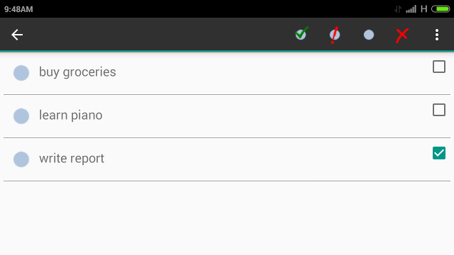

# My Todolist
This is a todolist app built for android platform using java. This app has multiple activities, RecyclerView, Customized Action Bar, Context Action Bar, and SQLite.

## Implementation Details
### Multiple Activities
This app has 3 activities.
* Main Activity is where the list is displayed using RecyclerView.
* New Todo Activity
* Edit Todo Activity

Communication between activities is done through Intents.

### RecyclerView
RecyclerView is used instead of ListView because it's better. It has insert/delete/update animations. You can update one item at a time. And ofcourse it's easier than implementing a ListView once you understand the ViewHolder pattern.

### Contextual Action Bar
When a long click event occurs on a todolist item the contextual action bar will be shown. You can also see checkbox added to each list item (although not part of contextual action bar). You can mark your todo's as important or done. You can also do item selection and deletion.

### SQLite
The app uses SQLite database for permanent storage. Instead of writing to database everytime the todolist is changed; the todolist is loaded only once from the database when the app is started. This todolist is buffered in the custom Application class. The application class allows the app to retain the todolist during configuration changes (Note: configuration change causes the activities to be destroyed along with it's data).

The todolist is saved to database everytime app is stopped. Database transactions are used for faster processing and performed using AsyncTask so it doesn't block the main thread.

## SNAPSHOTS

When app starts for first time.

new todo activity (edit todo is similar)

the top bar (with icons) is a contextual action bar

contextual action bar hidden menu

todo's marked important and completed

in landscape mode

## TODO

* search
* drag and drop